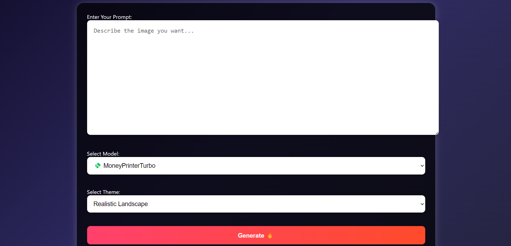

# 🌟 FREE IMAGE GENERATOR 🚀


---

> ⚠ **This tool is for educational, research, personal hobby projects & non-commercial use only.**

---

## Preview



## 🎯 What is Free Image Generator?

🎨 **Free Image Generator** is a fully open-source, AI-powered tool that allows anyone to easily generate stunning images directly from text prompts.

With multiple models, creative themes, and custom aspect ratios — you can turn your imagination into art in seconds ⚡

🖼️ Whether you're making anime art, fantasy worlds, futuristic cities, or even 3D robots — this app got you covered!

---

## 🌐 How To Use

1️⃣ After running, open your browser and visit:  
**http://127.0.0.1:5000/**

2️⃣ 🔥 Enter your text prompt in the big box.  
3️⃣ 🎯 Select your favorite model & theme.  
4️⃣ 🖼️ Choose aspect ratio.  
5️⃣ 💥 Hit **Generate Image** button.  
6️⃣ 🎉 Boom! Your AI-generated image will appear below.  
7️⃣ 💾 You can right-click and save the image anytime.

---

## 🎯 Available Models

We support multiple models from several AI image engines for better results:

- 💸 **MoneyPrinterTurbo**
- 🎎 **Anime Character Generator**
- 📜 **Jackey**
- 🎨 **Polynate**
- 😂 **Memed**
- 🎭 **Elixpo-Art**
- 🎼 **MIDIjourney**
- 🎞 **TurboReel**
- 📖 **StoryWeaver**
- 🎤 **AI PPT Maker**
- ⚡ **flux**
- 🚀 **turbo**

---

## 🌈 Support & Contribute

- Feel free to **fork and modify** 🍴
- **Pull Requests are welcome** 🚀
- **Star ⭐ the repo** if you love it ❤️
- 🎉 Enjoy generating unlimited AI images with **Free Image Generator**!

---

## 🚀 How To Install & Run

### 🖥 Requirements

- ✅ Python 3.9+
- ✅ Virtualenv (optional but highly recommended)

### 🔧 Setup Guide (One Click Copy ✅)

```bash
# 1️⃣ Clone the repo:
git clone https://github.com/mrrprofcoder/Free-Image-Genrator.git

# 2️⃣ Move into the folder
cd Free-Image-Genrator

# 3️⃣ (Optional) Create a virtual environment
python -m venv venv

# 4️⃣ Activate your venv
# Windows:
venv\Scripts\activate
# Mac/Linux:
source venv/bin/activate

# 5️⃣ Install dependencies
pip install -r requirements.txt

# 6️⃣ Run the app
python Main/app.py
